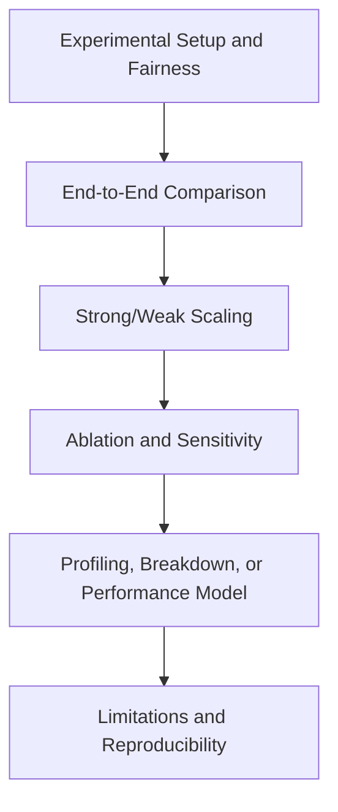

# Experiments Writing Guide for HPC Papers

## Goal

Convince reviewers with complete evidence on performance, scalability, causality, fairness, and practical value.

Before planning results, use `references/hpc-terminology.md` to lock metric names, units, platform terms, baseline names, and comparison conditions. Use `references/performance-evidence.md` when checking whether each claim has the right proof.

## Three Core Questions

1. Is the method better than strong baselines?
   - Compare against strong, recent, and directly relevant baselines.
   - Report end-to-end metrics, not only kernel-level or microbenchmark metrics.
   - Make the comparison setting clear: hardware budget, software versions, tuning budget, preprocessing, placement, and evaluation protocol.
   - Keep baseline names, hardware names, library names, and metric units exactly consistent across text, figures, and tables.
2. Which modules/design choices make the gain?
   - Run ablation studies for each key module/design choice.
   - Use remove/replace/disable variants and report delta to the full system.
   - Include component interaction ablations when modules are coupled.
   - Pair important ablations with profiling or breakdown evidence.
3. How far can the method generalize under harder settings?
   - Evaluate larger problem sizes, more nodes/GPUs, weaker network links, tighter memory budgets, or more diverse workloads when relevant.
   - Report both gains and failure modes to show realistic boundaries.
   - Explain the new bottleneck when scaling stops.

## Experiment Section Decomposition

## Baseline Fairness Checklist

State or verify the following before claiming improvement:

1. Baseline choice: strongest public systems, algorithms, libraries, or runtimes for the same task.
2. Tuning budget: compiler flags, algorithmic parameters, library backends, and baseline-specific optimizations.
3. Software stack: compiler, MPI, OpenMP runtime, CUDA/HIP/SYCL toolkit, domain libraries, file system, and scheduler.
4. Hardware budget: node count, GPU count, rank/thread mapping, memory capacity, interconnect, and storage.
5. Placement and affinity: ranks per node, threads per rank, GPU binding, NUMA policy, CPU affinity, and process pinning.
6. Measurement policy: warm-up, repetition count, median/mean, variance, confidence interval, and outlier handling.
7. Normalization: baseline used for normalized speedup, excluded time, and whether preprocessing or I/O is included.

## Scaling Evidence

Use scaling evidence when the paper claims scalability, parallel efficiency, or large-scale value.

### Strong Scaling

1. Keep total problem size fixed.
2. Report runtime, speedup, and parallel efficiency.
3. Include the ideal scaling line when possible.
4. State node/GPU/rank/thread mapping for each scale.
5. Explain the scaling ceiling: communication, synchronization, load imbalance, memory bandwidth, I/O, or scheduling overhead.

### Weak Scaling

1. State the per-node, per-GPU, or per-rank problem-size policy.
2. Report runtime/throughput and weak-scaling efficiency.
3. Keep workload generation and data distribution comparable across scales.
4. Explain which costs grow with scale and why.

### Throughput Scaling

1. Define the unit: tasks/s, samples/s, iterations/s, requests/s, or another domain-specific unit.
2. Report latency or tail latency when throughput alone can hide degraded service quality.
3. State whether the workload is closed-loop, open-loop, batched, or streaming.

## Statistical Rigor

1. Report how many runs were used for each result.
2. Prefer median plus variability for noisy cluster measurements.
3. Explain outlier removal only when there is a principled policy.
4. Separate one-time initialization from measured steady-state runtime.
5. Repeat at enough scale to expose scheduling, network, and file-system variability when relevant.

## Profiling and Causality

A high-level HPC paper should explain where the gain comes from.

Use at least one of the following for important claims:

1. Runtime breakdown: compute, communication, synchronization, I/O, memory transfer, scheduling.
2. Communication analysis: volume, number of messages, collective time, halo exchange time, overlap.
3. Memory analysis: bandwidth, cache behavior, HBM/DRAM footprint, allocation pressure, data movement.
4. Roofline or bandwidth model: when the claim depends on architectural limits.
5. Timeline or trace: when overlap, pipelining, or synchronization is central.
6. Ablation plus profiling: when the paper needs to prove a module causes the improvement.

## End-to-End vs Kernel-Level Results

1. Use end-to-end results as the main evidence for system value.
2. Use kernel-level or microbenchmark results only to explain a mechanism.
3. If a paper claims a system-level gain, include setup, communication, synchronization, memory movement, and I/O unless there is a clear reason to exclude them.
4. State exclusions explicitly. For example: `The reported runtime excludes one-time mesh generation but includes halo exchange and output writing.`

## Figure and Table Writing Rules

Good figures and tables are part of experiment communication quality, not decoration. Use `references/figures-tables.md` for detailed plot guidance.

### Table Rules

1. Put caption above the table.
2. Avoid vertical lines in tabular columns.
3. Use `booktabs` style (`\toprule`, `\midrule`, `\bottomrule`) for clean structure.
4. Use as few horizontal rules as possible; lines should separate groups, not every row.
5. Label metric direction and units in column headers, for example `Runtime (s) down`, `Throughput (tasks/s) up`, `Parallel efficiency (%) up`, `Memory (GB) down`, `Energy (J) down`, `Bandwidth (GB/s) up`, or `Performance (TFLOP/s) up`.
6. Align text columns left and numeric columns consistently.
7. Keep numeric precision consistent within a metric.
8. One table, one message: do not mix unrelated results in a single table.
9. Always label platform, problem size, and measurement method in the caption or table header.

### Minimal LaTeX Checklist

1. Add packages in preamble: `\usepackage{booktabs}`, `\usepackage{colortbl,xcolor}` if using cell color, and optionally `\usepackage{siunitx}` for decimal alignment.
2. Replace `\hline`-heavy style with `\toprule/\midrule/\bottomrule`.
3. Put `\caption{...}` before `\label{...}` and keep caption above tables.
4. Use restrained highlighting; never color too many cells.

## Recommended Evidence Package

1. One end-to-end comparison against strong baselines.
2. One strong-scaling or weak-scaling figure when scale is a claim.
3. One core ablation table for all major design choices.
4. Focused mini-ablations for sensitive parameters.
5. Profiling, breakdown, roofline, or performance-model evidence for the main bottleneck.
6. One limitation or stress-test result that shows the method boundary.

## Experimental Rigor Checklist

1. Are baselines recent, strong, and fairly tuned?
2. Are metrics standard and sufficient for the target workload?
3. Are claims in Abstract/Introduction supported by reported numbers?
4. Are end-to-end results separated from kernel-level or local-module results?
5. Are strong/weak scaling and parallel efficiency reported when relevant?
6. Is the source of speedup explained by profiling, ablation, or a performance model?
7. Are workloads large and diverse enough to validate the claim?
8. Are limitations and scaling ceilings explicitly stated?
9. Is the hardware/software environment detailed enough to reproduce the benchmark?
