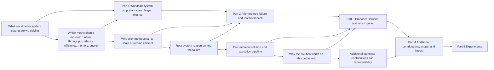

# Introduction Writing Guide for HPC Papers

## Goal

Write a strong HPC introduction in three steps:

1. Think through the introduction logic.
2. Apply a suitable template below.
3. Revise the introduction repeatedly.

Before choosing a template, create a terminology ledger using `references/hpc-terminology.md`. The Introduction should not replace specialized HPC terms with generic prose: workload, platform, parallel model, execution entities, memory/data movement, metrics, and baselines must stay precise.

## Introduction Logic Map



## How to Think About Introduction: Backward First, Then Forward

### Backward reasoning (answer these first)

1. What workload or system problem do we solve, and why is there no well-established solution? (important)
2. What are the contributions of our pipeline, runtime, or system design?
3. What are the benefits of our contributions, why can they solve this technical challenge, and what measurable insight do they bring? (important)
4. How do we use prior methods to lead readers to our solved bottleneck and our new insight?
5. Which specialized terms must remain stable across the whole Introduction?

### Forward story (write in this order)

1. Introduce the workload, platform, and why the target metric matters.
2. Use prior methods to lead to the technical challenge we solve.
3. Present xx contributions to solve this technical challenge.
4. Explain technical advantages of our contributions and explicitly express our new insight. (important)
5. Recheck every paragraph against the terminology ledger before finalizing.

## Section Skeleton

```latex
\section{Introduction}
% Workload/system context and why the target metric matters
% Terminology ledger: workload, platform, parallel model, execution entity, memory/data movement, metric, baseline
% Technical challenge for previous methods (limitation + root cause)
% Introduce our pipeline or system for solving the challenge
% Evidence summary
% Contributions
```

## Part A: Introduce Workload, System, and Target Metric

### Version 1

`Version 1: If the workload or system setting is relatively niche, introduce it first, then introduce applications and target metrics.`

Writing structure:

1. Define the workload, platform, or system setting in one clear sentence.
2. Briefly explain the target metric or system objective.
3. Introduce application value with 2-3 representative scenarios.
4. Use exact terms for the platform and execution model, such as MPI ranks, OpenMP threads, GPU kernels, NUMA domains, collectives, or host-device transfers when relevant.

Sentence skeleton:

1. `[xxx workload/system] targets at reducing runtime / increasing throughput / improving efficiency under [xxx platform or constraint].`
2. `[xxx workload/system] has a variety of applications such as [xxx], [xxx], and [xxx].`
3. `In this setting, [canonical execution entity] and [canonical memory/data-movement term] dominate [target metric].`

Local cite:

1. `references/examples/introduction/version-1-task-then-application.md`

### Version 2

`Version 2: If the workload or system pattern is already familiar to most readers, introduce applications and bottlenecks directly.`

Writing structure:

1. Skip formal task definition.
2. Open with application importance in one concise sentence.
3. Optionally append target requirement (e.g., efficiency/scaling/latency/energy).
4. Name the exact HPC metric instead of using generic `performance`.

Sentence skeleton:

1. `[xxx workload/system] has a variety of applications such as [xxx], [xxx], and [xxx].`
2. `These applications require [strong/weak scaling, throughput, latency, memory bandwidth, energy efficiency] on [platform].`

Local cite:

1. `references/examples/introduction/version-2-application-first.md`

### Version 3

`Version 3: Introduce applications of the general system class first, then introduce the specific workload or deployment setting. (Personally recommended when the setting is relatively new.)`

Writing structure:

1. Start from the general task and why it matters.
2. Narrow down to the specific setting of this paper.
3. Clarify exact workload, platform, and boundary of the setting.
4. Preserve names for libraries, runtimes, hardware generations, and metrics.

Sentence skeleton:

1. `[general HPC/system class] has a variety of applications such as [xxx], [xxx], and [xxx].`
2. `This paper focuses on the specific setting of improving [xxx metric] for [xxx workload] under [xxx hardware or software constraint].`
3. `We use [canonical term] to refer to [definition], and keep this term throughout the paper.`

Local cite:

1. `references/examples/introduction/version-3-general-to-specific-setting.md`

### Version 4

`Version 4: If the workload is familiar, introduce applications directly and expose the target technical challenge in the opening paragraph via previous methods (failure cases / target metric improvements).`

Writing structure:

1. Start with workload/application importance.
2. Immediately summarize how representative previous methods work.
3. Immediately expose the unresolved failure case + technical reason.
4. Use this opening as a bridge to the later prior-work paragraphs.
5. Make the failure case term precise: collective synchronization, load imbalance, memory bandwidth saturation, I/O contention, kernel launch overhead, host-device transfer, or another exact bottleneck.

Opening-paragraph skeleton:

1. `[Task/application importance sentence].`
2. `Given workload ..., previous methods usually ...`
3. `Although they work in many cases, they fail at ... because ...`
4. `This failure appears as [metric degradation] under [platform/problem-size condition].`

Expert note:

1. It is often good if the first paragraph already states what problem you want to solve, instead of requiring several paragraphs of prior work before the challenge appears.
2. This style needs the right conditions and is less common.
3. Typical Version 4 flow: Part 1 (task + application and directly expose challenge via previous methods 1) -> Part 2 (previous methods 2 try to solve it but still fail) -> Part 3 (our method).
4. More common general flow: Part 1 (task + application) -> Part 2 (previous methods 1 + limitation) -> Part 3 (previous methods 2 + limitation; here the target challenge emerges) -> Part 4 (our method).

Local cite:

1. `references/examples/introduction/version-4-open-with-challenge.md`

## Part B: Introduce Technical Challenge for Previous Methods (Very Important)

Purpose:

1. Discuss around the exact technical bottleneck we solved.
2. Build reader curiosity about how to solve this challenge.
3. Make motivation/benefit of our method clear.
4. Use bottleneck terms that identify the system layer, not generic phrases like `low efficiency` or `high overhead` alone.

Key logic before writing (faithful translation):

1. First make clear the logic for "leading to the technical challenge we solved".
2. For existing HPC settings: identify which recent methods have this bottleneck, why those methods exist, and optionally what earlier bottleneck they were trying to solve.
3. For novel settings: at minimum, define the technical challenge solved by our pipeline.

Important warning :

1. Do not first present a naive solution and then describe our improvement over it.
2. That writing makes the work look like a low-score incremental patch.
3. Even if the work is actually incremental, do not write it this way.
4. Why: this writing style can erase reader curiosity and make the idea look straightforward only because the writing hand-holds the reader.

### Technical-Challenge Version 1 (existing workload, with existing methods)

`Version 1: For existing workloads, discuss the challenge chain from general bottleneck -> traditional methods -> recent methods -> remaining bottleneck that we solve.`

Writing structure:

1. Start with a general bottleneck statement for this workload.
2. Briefly summarize traditional methods and their limitation.
3. Briefly summarize recent methods (1) and their limitation with technical reason.
4. Briefly summarize recent methods (2) and their limitation with technical reason.
5. Ensure the final limitation is exactly the bottleneck your method solves.
6. Keep entity names stable: if the limitation is per-rank imbalance, do not later call it per-thread imbalance.

Sentence skeleton:

1. `This problem is particularly challenging due to ...`
2. `To overcome these challenges, traditional methods ... However, they ...`
3. `Recently, ... methods ... However, they ... because ...`
4. `To overcome this bottleneck, ... methods ... However, they ... because ...`
5. `As a result, [canonical metric] degrades when [canonical execution/memory/communication condition].`

Local cite:

1. `references/examples/introduction/technical-challenge-version-1-existing-task.md`

### Technical-Challenge Version 2 (existing workload + our insight seen in traditional methods)

`Version 2: For existing workloads, when our insight has historical roots in traditional methods, use that line as conceptual backing and then show why new methods still fail.`

Writing structure:

1. Start from mainstream methods and state their limitation.
2. Introduce a classical/traditional line that already contains insight similar to yours.
3. Explain why that classical line is still insufficient.
4. Return to modern methods and show the unresolved technical reason.
5. Bridge to your method naturally.
6. Use the same terminology when comparing classical and modern methods; otherwise the conceptual lineage becomes unclear.

Sentence skeleton:

1. `...`

Local cite:

1. `references/examples/introduction/technical-challenge-version-2-existing-task-insight-backed-by-traditional.md`

### Technical-Challenge Version 3 (novel workload / novel deployment)

`Version 3: For a novel workload or new deployment setting, decompose the technical challenge into the most important barriers the reader must understand.`

Writing structure:

1. State the new workload or deployment setting clearly.
2. Split the challenge into 2-3 barriers, such as communication cost, synchronization cost, load imbalance, or memory pressure.
3. Explain why each barrier is hard in this setting.
4. Use the decomposition to motivate the method.
5. Assign each barrier a canonical term and reuse that term in the contribution paragraph.

Local cite:

1. `references/examples/introduction/technical-challenge-version-3-novel-task.md`

## Part C: Introduce Our Pipeline / System

### Version 1

1. Give a one-sentence overview of the system idea.
2. Name the main modules and what each module solves.
3. Explain why the pipeline should improve the target metric.
4. Mention what the experiments confirm.
5. Map module names to terminology-ledger terms so the same module is not renamed later.

### Version 2

1. Introduce the system idea from the bottleneck perspective.
2. Emphasize the main technical insight.
3. Add a short statement about how the insight becomes a full pipeline.
4. Point to the method section for details.

### Version 3

1. Introduce one contribution per sentence.
2. Attach a concrete performance or scalability advantage to each contribution.
3. Keep the system term consistent across the introduction.

### Version 4

1. Start from an observed bottleneck or profiling result.
2. Show the design decision that follows from it.
3. End with a sentence explaining why this is better than the obvious alternative.

## Introduction Quality Checklist

1. Can a reviewer identify workload, platform, bottleneck, solution, and evidence in one pass?
2. Are the key claims tied to actual scaling or performance results?
3. Are system assumptions and metric targets explicit?
4. Are all technical terms introduced before reuse?
5. Does each paragraph carry one clear message with smooth transitions?
6. Do HPC terms stay precise and consistent across workload, platform, execution entities, bottlenecks, metrics, and baselines?
