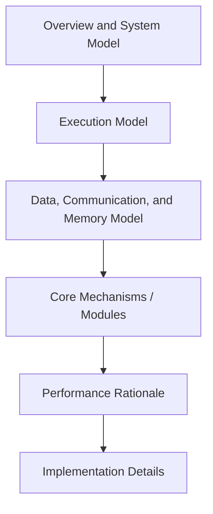

# Method Writing Guide for HPC Papers

## Goal

Write the Method section so reviewers can understand the system model, execution model, mechanism, and performance rationale without guessing hidden assumptions.

Before writing, use `references/hpc-terminology.md` to build a method terminology ledger. Module names, execution entities, data structures, runtime/library names, memory hierarchy terms, and communication terms must remain stable across text, equations, algorithms, and figures.

## Pre-Writing Questions

Answer these before drafting Method:

1. What system setting does the method assume: node topology, accelerators, interconnect, storage, runtime, and software stack?
2. What are the main modules or algorithmic phases?
3. For each module, what is the workflow, why is it needed, and why does it work?
4. What execution entities own work and data: MPI ranks, OpenMP threads, tasks, GPU streams, kernels, blocks, warps, or requests?
5. What communication, synchronization, memory, I/O, or scheduling bottleneck does each module target?
6. What implementation details are required for reproduction: build flags, launch configuration, buffer sizes, placement, affinity, precision, and library versions?

## Method Section Decomposition

## Overview Subsection

The overview should establish the reader's mental model.

1. State the workload and deployment setting.
2. State the core insight or design principle.
3. Point to the system overview figure if present.
4. Summarize the main modules in execution order.
5. Map the rest of the Method section to these modules.

Sentence skeleton:

1. `[System] targets [workload] on [platform] where [bottleneck] limits [metric].`
2. `The key idea is to [mechanism], thereby [expected effect on communication/memory/synchronization/load balance].`
3. `Figure X shows how [ranks/threads/GPU kernels/tasks] move data through [modules].`

## System Model

State the assumptions that define the scope of the method:

1. Hardware: nodes, sockets, cores, accelerators, memory hierarchy, network, and storage.
2. Software: compiler, MPI/OpenMP/CUDA/HIP/SYCL/task runtime, libraries, file system, and scheduler.
3. Workload: input format, problem size, precision, data distribution, update pattern, and convergence/iteration behavior.
4. Failure model or deployment constraint when relevant.
5. Scope boundaries: unsupported hardware, workload, or runtime assumptions.

Do not hide the system model late in Experiments if it is necessary to understand the method.

## Execution Model

Explain how work is mapped to execution entities.

1. Rank/process mapping: ranks per node, ownership of subdomains or partitions.
2. Thread/task mapping: OpenMP teams, task queues, work stealing, or scheduling policy.
3. GPU mapping: streams, kernels, blocks, warps/wavefronts, shared memory, and launch order.
4. Synchronization: barriers, collectives, atomics, locks, epochs, or pipeline boundaries.
5. Data ownership: which entity owns each buffer, partition, tile, request, or checkpoint.

Use exact terms. Do not switch between `rank`, `worker`, `thread`, and `task` unless they mean different entities.

## Data and Communication Model

Describe data movement before detailed optimization logic:

1. Decomposition: domain decomposition, graph partitioning, tiling, sharding, batching, or replication.
2. Communication path: point-to-point, halo exchange, all-reduce, broadcast, gather/scatter, RPC, or file-system I/O.
3. Communication schedule: blocking, nonblocking, overlapped, pipelined, aggregated, compressed, or topology-aware.
4. Synchronization points: where progress can stall and why.
5. Measurement target: communication volume, message count, latency, bandwidth, or stall time.

## Memory Model

When memory behavior matters, specify:

1. Memory hierarchy: cache, DRAM, HBM, device global memory, shared memory, registers, unified memory, or storage.
2. Allocation and layout: structure of arrays, array of structures, tiling, padding, alignment, or pooling.
3. Transfer path: host-device, GPU-GPU, NIC-GPU, file-system-to-memory, or staged copies.
4. Locality mechanism: reuse, cache blocking, NUMA placement, prefetching, compression, or data compaction.
5. Memory boundary: peak footprint, capacity limit, spill behavior, or fragmentation risk.

## Core Module Writing Pattern

Each module subsection should contain motivation, design, and technical advantage.

1. Motivation: name the bottleneck and why existing approaches fail in this setting.
2. Design: define inputs, outputs, data structures, execution order, and interactions with other modules.
3. Advantage: explain how the design changes communication, memory, synchronization, load balance, or I/O behavior.
4. Evidence hook: state which experiment or profiling result will validate the advantage.

Sentence skeleton:

1. `This phase addresses [bottleneck] that appears when [condition].`
2. `Given [input/data partition], [execution entity] first [step], then [step], and finally [output].`
3. `This design reduces [communication volume/stall time/memory traffic/synchronization] because [mechanism].`
4. `Section X validates this effect with [scaling/ablation/profiling].`

## Performance Rationale

High-level HPC Method sections should explain why the design should work before Experiments proves it.

Use one or more:

1. Complexity argument: asymptotic work, communication volume, memory footprint, or synchronization count.
2. Performance model: cost terms for compute, communication, memory, I/O, and scheduling.
3. Roofline or bandwidth reasoning: when performance is limited by compute or memory bandwidth.
4. Load-balance argument: how work distribution, stealing, or partitioning reduces stragglers.
5. Overlap argument: what operations overlap and what dependency makes overlap valid.

Keep the argument lightweight and falsifiable. Do not overclaim beyond the model assumptions.

## Algorithm and Pseudocode Guidance

Use pseudocode when prose alone cannot make execution order clear.

1. Name execution entities explicitly in algorithm inputs or comments.
2. Mark communication and synchronization operations.
3. Separate local compute from remote communication and I/O.
4. State whether the algorithm is per-rank, per-node, per-GPU, or global.
5. Keep notation consistent with equations, figures, and experiments.

## Implementation Details

Document practical details that affect reproducibility or performance:

1. Compiler, build flags, and optimization level.
2. MPI/OpenMP/CUDA/HIP/SYCL/runtime/library versions.
3. Kernel launch configuration, block size, stream count, or task granularity.
4. Buffer sizes, memory pools, data layout, and precision.
5. Rank/thread/GPU placement and NUMA affinity.
6. Scheduler options, environment variables, and file-system configuration when relevant.
7. Parameters that were tuned and the tuning policy.

## Method Clarity Check

1. Can a reviewer draw the system model after reading the overview?
2. Are execution entities and data ownership unambiguous?
3. Does each module solve a named bottleneck?
4. Is the performance rationale tied to communication, memory, synchronization, I/O, load balance, or compute?
5. Are assumptions and limitations stated before they become reviewer surprises?

## Example Bank

1. `references/examples/method-examples.md`
2. `references/examples/method/pre-writing-questions.md`
3. `references/examples/method/module-triad-mpi-cuda-stencil.md`
4. `references/examples/method/annotated-system-overview-halo-exchange.md`
5. `references/examples/method/module-design-communication-overlap.md`
6. `references/examples/method/module-motivation-patterns.md`
7. `references/examples/method/section-skeleton.md`
8. `references/examples/method/overview-template.md`
9. `references/examples/method/example-of-the-three-elements.md`
10. `references/examples/method/method-writing-common-issues-note.md`
11. `references/examples/hpc/mpi-cuda-stencil.md`
12. `references/examples/hpc/sparse-matrix-gpu.md`
13. `references/examples/hpc/collective-optimization.md`
14. `references/examples/hpc/parallel-io-checkpointing.md`
15. `references/examples/hpc/numa-aware-task-runtime.md`
